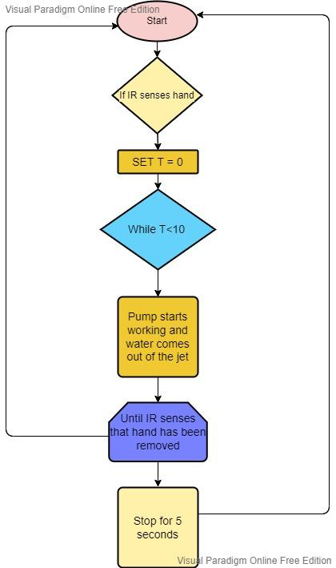
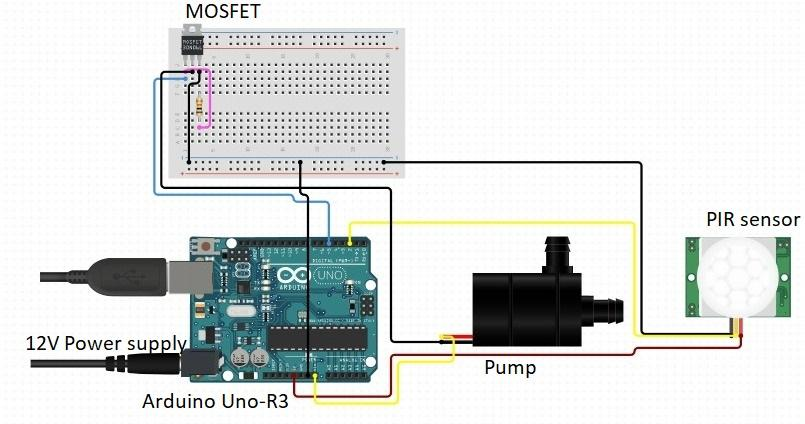
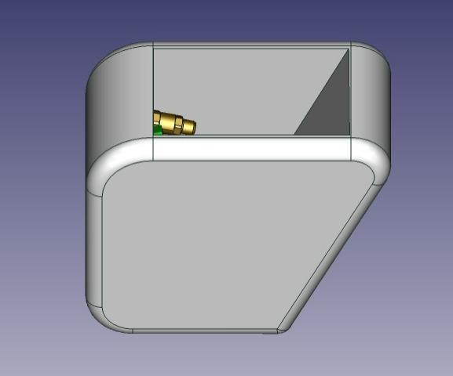

# AquaZippyOpenIIT
## An arduino code for the automatic hand washing system that uses an algorithm to minimize the water wastage and maximize the efficiency
### Flowchart
<html>
<body>

<h3> Circuit Diagram 

<h3> Final Product: Aquazippy 

</body>
</html>
